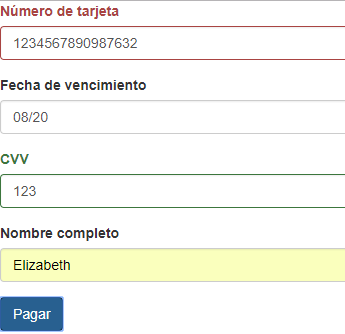

# App que valida tarjetas de crédito

* **Track:** _Common Core_
* **Empresa:** _Proyecto elaborado por alumna de [Laboratoria](http://www.laboratoria.la/)_
* **Enlace:** [Enlace al proyecto](https://superliza.github.io/card-validator-without-plugin/)

---

Se recibe un elemento DOM que contiene los siguentes atributos:
* `cn` (Card Number): El número de la tarjeta de crédito
* `exp` (Expiry Date): Fecha de expiración
* `cvv` (Card Verification Value): Código de validación de 3 dígitos
* `name`: Nombre completo como aparece en la tarjeta

Una vez que se han recibido los atributos correspondientes se realiza una verifiación para saber si la tarjeta de crédito ingresada es válida.

**Se utilizaron las siguientes tecnologías:**

* `JavaScript`: Lenguaje de programación usado del lado del cliente.
* `CSS`: Lenguaje de diseño usado para definir la presentación de la página.
* `HTML5`: Lenguaje de marcado usado para crear la estructura de la página.

---

## Capturas:

